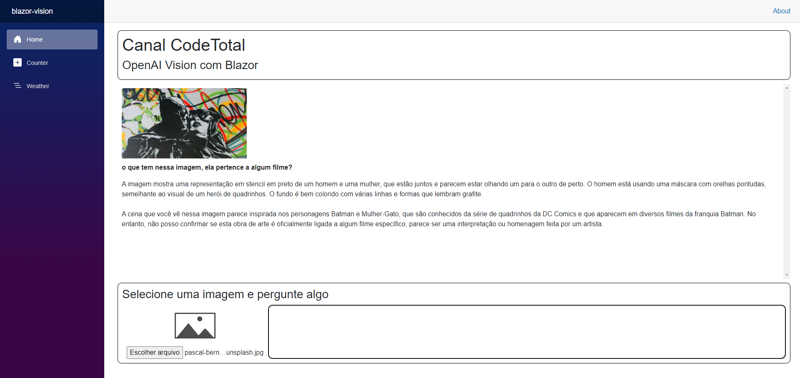

# BLAZOR-OPENAI-VISION

Application created in C# (Blazor InteractiveServer) that exploits OpenAI's Vision API for image detection and analysis

## What's done:

- Sending the image
- Payload Serialization
- Response Serialization
- Scrollable Q&A area

## What remains to be finished:

- Save the content obtained
- Integration with regular text GPT

## Challenges:

- OAuth2 with OpenAI to obtain the API Key
